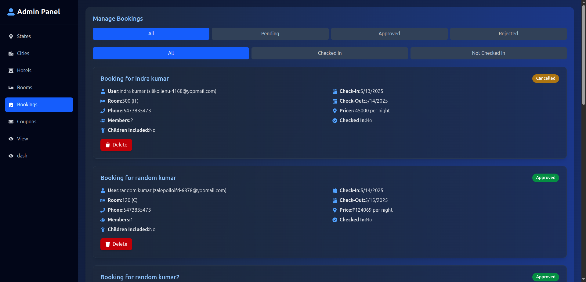
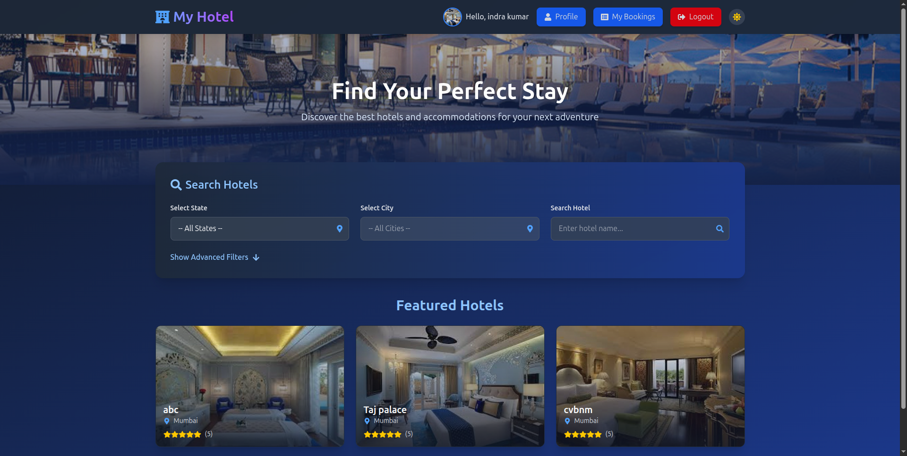
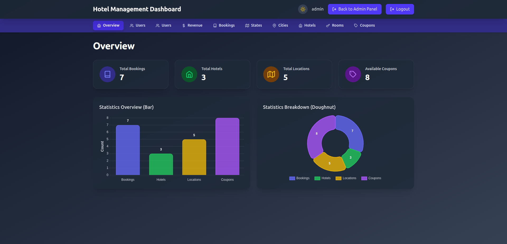

# Hotel Management System

## Overview

The Hotel Management System is a full-stack web application designed to streamline hotel operations through three main components: the **Admin Panel**, **User Panel**, and **Dashboard**. This system enables administrators to manage hotels, bookings, users, and revenue, while offering users a seamless experience to book rooms, view bookings, and manage profiles. The Dashboard provides real-time data visualization and analytics.

Built using modern technologies, the system features a React-based frontend and a Node.js/Express backend (running at `http://localhost:6969`). It includes role-based access, responsive design, and real-time charts for a robust hotel management experience.

---

## Project Components

### 1. 🛠️ Admin Panel

A control center for administrators with comprehensive features:

* 👥 Manage users (view, edit, delete).
* 📋 Oversee bookings with filters (status, hotel, date).
* 🏨 Manage hotels, rooms, states, and cities.
* 🎟️ Create and manage coupons.
* 📊 Access revenue analytics with filters and charts.

### 2. 👤 User Panel

Provides a booking and management interface for end-users:

* 🗺️ Browse hotels and rooms by state and city.
* 🛏️ Book rooms with date selection and coupons.
* 📅 View and manage bookings.
* ⚙️ Update profile information.

### 3. 📈 Dashboard

Interactive data visualization for admins and users:

* 📊 Overview of stats (bookings, hotels, locations, coupons).
* 📉 Revenue trends with date/location filters.
* 📑 Booking tables with sorting and pagination.
* 🌙 Dark mode toggle.

---

## Features

### 🔐 Role-Based Access

* Admins: Full management access.
* Users: Booking and profile management.

### 🔍 Filtering & Sorting

* Filters by status, date, hotel, location.
* Search and sort tables.

### 📊 Data Visualization

* Charts using Chart.js (Bar, Doughnut, Line).
* Revenue trends and breakdowns.

### 💻 UI/UX Enhancements

* Responsive design (Tailwind CSS).
* Dark mode toggle.
* Paginated tables.

### 🔒 Authentication

* JWT-based secure login for users and admins.

---

## Technologies Used

### 🧑‍💻 Frontend

* React.js
* React Router
* Axios
* Chart.js + react-chartjs-2
* Tailwind CSS
* React Icons
* chartjs-plugin-datalabels

### 🖥️ Backend

* Node.js
* Express.js
* MongoDB
* JWT for auth

### 🛠️ Others

* Git for version control
* npm/Yarn for dependencies

---

## Prerequisites

* Node.js v16+
* npm v8+ / Yarn
* MongoDB
* Running backend API at `http://localhost:6969`

---

## Setup Instructions

### 1. 🔁 Clone the Repository

```bash
git clone https://github.com/FullStackParihar/hotel-management-system.git
cd hotel-management-system
```

### 2. 🏗️ Backend Setup

```bash
cd backend
npm install
```

Create `.env`:

```
PORT=6969
MONGODB_URI=mongodb://localhost:27017/hotel_management
JWT_SECRET=your_jwt_secret
```

Start the backend:

```bash
npm start
```

### 3. 🌐 Frontend Setup

```bash
cd frontend
npm install
```

Ensure API URL is set:

```js
const API_URL = 'http://localhost:6969/';
```

Start frontend:

```bash
npm start
```

Visit: `http://localhost:3000`

---

## Project Structure

```
hotel-management-system/
├── backend/
│   ├── config/
│   ├── controller/
│   ├── Crons/
│   ├── db/
│   ├── helpers/
│   ├── middleware/
│   ├── model/
│   ├── routes/
│   ├── utils/
│   ├── .env
│   ├── server.js
├── frontend/
│   ├── public/
│   │   ├── vite.svg
│   ├── src/
│   │   ├── assets/
│   │   ├── components/
│   │   │   ├── admin/
│   │   │   │   ├── AdminPage.jsx
│   │   │   │   ├── AdminPanel.jsx
│   │   │   │   ├── AdminSideBarTabs.jsx
│   │   │   │   ├── Location.jsx
│   │   │   │   ├── UserPage.jsx
│   │   │   ├── authentication/
│   │   │   ├── dashboard/
│   │   ├── routes/
│   │   ├── App.jsx
│   │   ├── index.jsx
```

---

## Screenshots

Add screenshots to `screenshots/` folder:





---

## Usage

### 👨‍💼 Admin Panel

* Login with admin credentials.
* Manage users, bookings, hotels, and coupons.
* Use the dashboard for revenue analytics.

### 🙋‍♂️ User Panel

* Register/login as user.
* Browse and book rooms.
* View booking history and update profile.

### 📊 Dashboard

* View metrics and charts.
* Filter revenue and bookings.

---

## API Endpoints

### 👤 User

* `GET /user/me`
* `GET /user/getAllUsers`
* `POST /user/register`
* `POST /user/login`

### 📝 Booking

* `GET /api/bookings/`
* `POST /api/bookings/`

### 📍 Location

* `GET /api/states`
* `GET /api/states/:id/cities`
* `GET /api/cities/:id/hotels`
* `GET /api/:hotelId/rooms`
* `GET /api/hotels`

### 🎟️ Coupon

* `GET /api/coupons`
* `GET /api/coupons/available`

---

## 🚀 Future Improvements

* Real-time notifications (WebSocket).
* Payment gateway integration.
* Accessibility (ARIA, keyboard nav).
* Unit testing (Jest, Mocha).

---

## 🤝 Contributing

1. Fork the repo.
2. Create a branch: `git checkout -b feature/your-feature`
3. Commit: `git commit -m "Add your feature"`
4. Push: `git push origin feature/your-feature`
5. Open a Pull Request.

---

## 🪪 License

MIT License. See `LICENSE` file for details.

---

## 📞 Contact

* **Name:** Vishnu Kumar
* **Email:** [vishnuparihar239925@gmail.com](mailto:vishnuparihar239925@gmail.com)
* **GitHub:** [FullStackParihar](https://github.com/FullStackParihar)

*Last updated: May 22, 2025*
